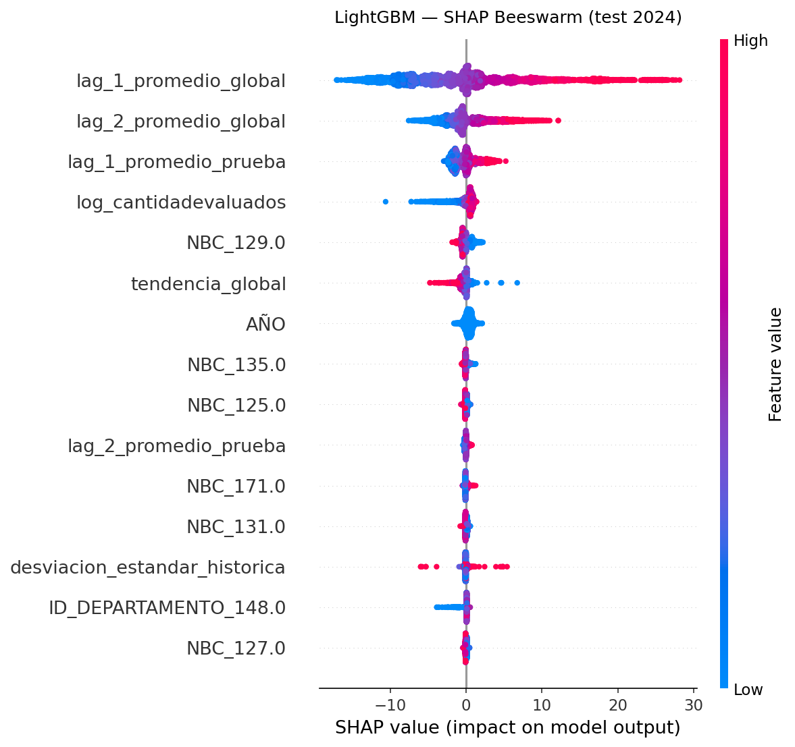

# Motor Predictivo Saber Pro 2020–2024


Pipeline reproducible de machine learning que predice el **PROMEDIO_GLOBAL** (desempeño académico agregado) de programas universitarios colombianos en el examen de Estado **Saber Pro ICFES**, usando datos de panel 2020–2024, alcanzando **RMSE=9.33 y R²=0.706** en test 2024 con LightGBM.

---

## Tabla de Contenido

- [Motivación](#motivación)
- [Características](#características)
- [Resultados](#resultados)
- [Estructura del Repositorio](#estructura-del-repositorio)
- [Instalación](#instalación)
- [Uso Rápido](#uso-rápido)
- [Flags de Confianza](#flags-de-confianza)
- [Los 6 Tipos de Leakage](#los-6-tipos-de-leakage)
- [Agregar un Nuevo Año](#agregar-un-nuevo-año)
- [Limitaciones](#limitaciones)
- [Citar este trabajo](#citar-este-trabajo)
- [Licencia](#licencia)

---

## Motivación

El ICFES publica los resultados Saber Pro **de forma retrospectiva**: las instituciones de educación superior no conocen su desempeño hasta después de que el examen ocurre. Esta asimetría de información genera una **gestión reactiva** de la calidad educativa, donde los ajustes curriculares y pedagógicos siempre llegan tarde.

Este motor predictivo cambia esa dinámica: al estimar el `PROMEDIO_GLOBAL` de cada combinación institución-programa-prueba **un año antes**, permite identificar programas en riesgo de caída y activar intervenciones preventivas antes de que el examen ocurra.

---

## Características

- **Pipeline reproducible de 8 fases** orquestado por `main.py`, con preflight de datos y artefactos
- **127.716 observaciones** post-pivot (1.73M filas crudas ICFES 2020–2024 procesadas)
- **6 tipos de data leakage identificados y corregidos** — impacto total ΔR²=0.22 en test
- **Comparativa de 4 modelos**: Ridge · Lasso · LightGBM (Optuna 50 trials) · Transformer encoder
- **Módulo de inferencia deployable** (`src/inference.py`) con 3 flags de confianza empíricos
- **Interpretabilidad SHAP** (TreeExplainer, beeswarm, feature importance gain)
- Split temporal estricto 2020–2023 (train) / 2024 (test) — sin información futura en train
- **Preparado para extenderse** a nuevos años ICFES, dejando claro qué partes requieren parametrización adicional (ver [Agregar un Nuevo Año](#agregar-un-nuevo-año))

---

## Resultados

Evaluación sobre el conjunto de test temporal 2024 (n=28.762, split estricto):

| Modelo | RMSE | MAE | R² | Notas |
|---|---|---|---|---|
| Ridge | 10.23 | 7.30 | 0.647 | Baseline regularización L2 |
| Lasso | 10.07 | 7.06 | 0.658 | Baseline selección L1 |
| **LightGBM** ⭐ | **9.33** | **6.21** | **0.706** | Optuna 50 trials, SHAP |
| Transformer | 16.86 | — | 0.041 | CPU 2.7 min, early stop ep.53 |

Fuente de verdad para Ridge/Lasso/LightGBM: `outputs/metrics/baseline_metrics.csv`.
Transformer se documenta en `outputs/reports/decision_transformer.txt` como comparación experimental, no como modelo final.

> **Modelo final seleccionado**: LightGBM. El archivo serializado `outputs/lgbm_model.pkl` se genera con la Fase 5 y no se versiona en Git por seguridad/tamaño.
> Mejora sobre mejor baseline: **−7.4% RMSE**, **+4.9% R²**
>
> El Transformer no es competitivo en este dataset (32k secuencias vs. 98k filas, sin features categóricas NBC/NOMBRE_PRUEBA). Ver [`paper/draft/06_discusion.txt`](paper/draft/06_discusion.txt) para análisis detallado.

### Importancia de Features (SHAP)

Top features por SHAP mean |value|: `NBC` (área del conocimiento) › `NOMBRE_PRUEBA` › `lag_1_promedio_global` › `AÑO` › `log_cantidadevaluados`



---

## Estructura del Repositorio

```
Sabero_Pro_ModeloPredictivo/
│
├── README.md                          # Este archivo
├── requirements.txt                   # Dependencias exactas
├── CHANGELOG.md                       # Historial de versiones
├── LICENSE                            # MIT License
├── .gitignore
│
├── main.py                            # Script maestro: ejecuta las 8 fases
├── fase1_auditoria.py                 # Auditoría de datos ICFES
├── fase2_limpieza.py                  # Limpieza + pivot long→wide
├── fase3_features.py                  # Feature engineering temporal
├── fase4_baseline.py                  # Ridge y Lasso con TargetEncoder
├── fase5_lightgbm.py                  # LightGBM + Optuna + SHAP
├── fase6_transformer.py               # Transformer encoder + outliers
├── demo_inference.py                  # Demo del módulo de inferencia
│
├── src/                               # Módulos del pipeline
│   ├── ingestion.py                   # Carga multi-año de archivos ICFES
│   ├── cleaning.py                    # Pivot long→wide + reglas de limpieza
│   ├── features.py                    # Lags, tendencia, volatilidad sin leakage
│   ├── evaluation.py                  # Métricas, plots, análisis por subgrupo
│   ├── inference.py                   # Predicción + flags de confianza
│   └── models/
│       ├── baseline.py                # Ridge/Lasso con Pipeline sklearn
│       ├── boosting.py                # LightGBM + Optuna + SHAP
│       └── transformer.py             # TransformerEncoder secuencial
│
├── data/
│   ├── raw/                           # Archivos ICFES originales (NO en git)
│   │   └── saber_pro_YYYY.xlsx        # Un archivo por año
│   └── processed/
│       ├── saber_pro_limpio.csv       # Post-pivot (127.716 × 24)
│       └── saber_pro_features.csv     # Con features (127.716 × 41)
│
├── outputs/
│   ├── CHECKLIST_FINAL.txt            # Verificación completa del pipeline
│   ├── lgbm_model.pkl                 # Generado por Fase 5 (NO en git)
│   ├── lgbm_best_params.json          # Hiperparámetros Optuna óptimos
│   ├── figures/                       # 23 gráficas PNG (SHAP, scatter, etc.)
│   ├── metrics/                       # 8 CSVs de métricas y errores
│   └── reports/                       # 11 reportes TXT (análisis, narrativas)
│
├── paper/
│   └── draft/                         # 8 secciones del artículo académico
│       ├── 01_titulo_y_abstract.txt
│       ├── 02_introduccion.txt
│       ├── 03_datos_y_metodologia.txt
│       ├── 04_feature_engineering.txt
│       ├── 05_resultados.txt
│       ├── 06_discusion.txt
│       ├── 07_conclusiones.txt
│       └── 08_referencias.txt
│
└── docs/
    ├── ARQUITECTURA_TECNICA.md        # Diseño del pipeline y decisiones clave
    └── GUIA_REPRODUCIBILIDAD.md      # Paso a paso para reproducir resultados
```

---

## Instalación

```bash
git clone https://github.com/Blaister9/Sabero_Pro_ModeloPredictivo.git
cd Sabero_Pro_ModeloPredictivo
pip install -r requirements.txt
```

> **Python 3.10+ requerido.** PyTorch se instala como CPU-only:
> ```bash
> pip install torch --index-url https://download.pytorch.org/whl/cpu
> ```

### Artefactos no versionados

Los archivos de datos crudos (`data/raw/saber_pro_YYYY.xlsx`) no están en Git por tamaño. Deben descargarse del ICFES y ubicarse con estos nombres:

```text
data/raw/saber_pro_2020.xlsx
data/raw/saber_pro_2021.xlsx
data/raw/saber_pro_2022.xlsx
data/raw/saber_pro_2023.xlsx
data/raw/saber_pro_2024.xlsx
```

Los modelos serializados tampoco se versionan: `outputs/ridge_model.pkl`, `outputs/lasso_model.pkl`, `outputs/lgbm_model.pkl` y `outputs/transformer_model.pt`. Se regeneran ejecutando las fases 4, 5 y 6. El repositorio sí incluye CSVs procesados, métricas, figuras, reportes y documentos académicos generados.

---

## Uso Rápido

### a) Ver preflight y ayuda

```bash
python main.py --help
python main.py --list-phases
```

### b) Pipeline completo desde datos raw

Requiere los cinco Excel en `data/raw/`. Si faltan, `main.py` termina con código de salida distinto de cero y muestra qué archivos debe descargar/renombrar.

```bash
python main.py --years 2020 2021 2022 2023 2024
```

### c) Continuar desde CSVs procesados

El repositorio versiona `data/processed/saber_pro_limpio.csv` y `data/processed/saber_pro_features.csv`. Si no tiene los Excel raw, puede continuar desde fases posteriores:

```bash
# Regenerar features desde saber_pro_limpio.csv
python main.py --only 3

# Entrenar modelos desde saber_pro_features.csv
python main.py --from-phase 4 --to-phase 6

# Generar el paper reproducible desde fuentes livianas
python main.py --only 8
```

La demo de inferencia (`fase 7`) requiere `outputs/lgbm_model.pkl`; si no existe, ejecútese primero la Fase 5.

### d) Fases individuales

```bash
python fase1_auditoria.py          # ~2 min
python fase2_limpieza.py           # ~3 min
python fase3_features.py           # ~2 min
python fase4_baseline.py           # ~5 min
python fase5_lightgbm.py           # ~10 min  (Optuna 50 trials)
python fase6_transformer.py        # ~5-20 min (presupuesto CPU)
python demo_inference.py           # ~1 min
```

Los scripts `fase*.py` actuales están calibrados para la ventana de referencia 2020-2024. `main.py` acepta `--years` para validar nombres esperados, pero no ejecuta fases de modelado con años distintos hasta parametrizar internamente los scripts por fase.

### e) Predicción individual

Requiere `outputs/lgbm_model.pkl`, generado por `python main.py --only 5`.

```python
from src.inference import load_model, predict_institution, format_prediction_report

model = load_model("outputs/lgbm_model.pkl")

resultado = predict_institution(
    model=model,
    año=2025,
    nbc="INGENIERÍA AMBIENTAL, SANITARIA Y AFINES",
    nombre_prueba="INGLÉS",
    id_departamento=1,
    cantidadevaluados=91,
    categoriaprueba=2,
    lag_1_promedio_global=142.0,   # PROMEDIO_GLOBAL año anterior
    lag_2_promedio_global=141.0,   # PROMEDIO_GLOBAL hace 2 años
    lag_1_promedio_prueba=152.0,
    lag_2_promedio_prueba=147.0,
    tendencia_global=0.5,
    tendencia_prueba=3.0,
    desviacion_estandar_historica=0.577,
    coeficiente_variacion=0.004,
    nombre_institucion="TECNOLÓGICO DE ANTIOQUIA",
    nombre_programa="INGENIERÍA AMBIENTAL",
)

print(format_prediction_report(resultado))
# PROMEDIO_GLOBAL predicho: 142.15
# Confianza global: MEDIA
# Flags: muestra_pequeña=False, sin_historial=False, extrapolacion=True
```

### f) Predicción en lote

```python
import pandas as pd
from src.inference import load_model, predict_batch

model = load_model("outputs/lgbm_model.pkl")
df = pd.read_csv("data/processed/saber_pro_features.csv", low_memory=False)
df_2025 = df[df["AÑO"] == 2024].copy()  # usar como proxy de entrada
df_2025["AÑO"] = 2025

resultados = predict_batch(df_2025, model)
print(resultados[["NOMBRE_INSTITUCION", "NOMBRE_PRUEBA",
                   "prediccion_promedio_global", "confianza_global"]].head())
```

---

## Flags de Confianza

El módulo de inferencia evalúa automáticamente tres flags basados en evidencia empírica del dataset:

| Flag | Condición | Origen empírico |
|---|---|---|
| `baja_confianza_muestra_pequeña` | `CANTIDADEVALUADOS < 5` | Outlier UMB prog. 742: N=1 → PROMEDIO=31 (real=154). Ver `outputs/reports/analisis_outliers.txt` |
| `baja_confianza_sin_historial` | `lag_1_promedio_global` es NaN | Primer año del programa — el modelo usa mediana imputada |
| `baja_confianza_extrapolacion` | `AÑO > 2023` | Predicción fuera del rango de entrenamiento |

**`confianza_global`**: `ALTA` (0 flags) · `MEDIA` (1 flag, solo extrapolación) · `BAJA` (≥2 flags o muestra pequeña)

Distribución en test 2024: MEDIA=84.4% · BAJA=15.6% (de los cuales 11.8% por muestra pequeña)

---

## Los 6 Tipos de Leakage

Identificados y corregidos durante el desarrollo. Impacto total: **ΔR²=+0.22** (de R²=0.658 honesto a R²≈0.88 con leakage).

| # | Tipo | Variable(s) | Corrección |
|---|---|---|---|
| L1 | Target encoding global | `te_nbc`, `te_nombre_prueba`, `te_id_departamento` | Mover `TargetEncoder` al interior del sklearn `Pipeline` |
| L2 | Variable concurrente: puntaje mismo año | `PROMEDIO_PRUEBA` (año t) | Reemplazar por `lag_1_promedio_prueba` (año t−1) |
| L3 | Variable concurrente: desviación mismo año | `DESVIACION` (año t) | Excluir del modelo |
| L4 | Variables concurrentes: niveles mismo año | `NIVEL1-4` (año t) | Excluir; renombrar a `concurrent_prop_*` |
| L5 | Target leak directo en feature de diferencia | `delta_1_global = PROMEDIO_GLOBAL(t) − lag_1` | Eliminar completamente |
| L6 | Tendencia/volatilidad con año actual | `tendencia_global`, `desviacion_estandar_historica` | Reescribir con `shift(1).expanding()` |

Ver [`docs/ARQUITECTURA_TECNICA.md`](docs/ARQUITECTURA_TECNICA.md) para código correcto vs. incorrecto de cada leakage.

---

## Agregar un Nuevo Año

Para incorporar datos de un año nuevo (ej. 2025):

**Paso 1.** Descarga el archivo de resultados Saber Pro del ICFES:
- URL: https://www.icfes.gov.co/resultados/saber-pro-resultados
- Sección: *Bases de datos de resultados por programa* → año 2025
- Renombra el archivo a `data/raw/saber_pro_2025.xlsx`

**Paso 2.** Valida que el archivo está ubicado correctamente:

```bash
python main.py --years 2020 2021 2022 2023 2024 2025 --dry-run
```

**Estado actual:** los scripts de fase (`fase1` a `fase6`) están calibrados para el experimento académico 2020-2024 y el split train 2020-2023 / test 2024. Para publicar resultados con 2025 se debe parametrizar `YEARS`, `YEAR_TEST`, reportes y nombres de salida en esas fases antes de reentrenar. `main.py` falla de forma explícita si se intenta ejecutar modelado con años distintos para evitar métricas engañosas.

---

## Limitaciones

| # | Limitación | Impacto |
|---|---|---|
| L1 | **5 años de historia** (2020–2024 incluye pandemia COVID-19) | Tendencias inter-anuales atípicas 2020–2021 |
| L2 | **Granularidad agregada** (programa-institución, no individual) | No captura heterogeneidad dentro del programa |
| L3 | **Sin variables externas** (socioeconómicas, mercado laboral) | NBC como EDUCACIÓN tiene RMSE=11.7, el más alto |
| L4 | **Catálogo de pruebas no estable** entre años | Genera entidades con historial incompleto no por ser nuevas |
| L5 | **Extrapolación a >1 año** no validada | Incertidumbre acumulada puede degradar R² |

---

## Citar este Trabajo

```bibtex
@software{paz2025saberpro,
  author    = {Paz Bedoya, Edwin Santiago},
  title     = {Motor Predictivo Saber Pro 2020--2024},
  year      = {2025},
  publisher = {GitHub},
  url       = {https://github.com/Blaister9/Sabero_Pro_ModeloPredictivo},
  note      = {Especialización en Inteligencia Artificial,
               Trabajo de grado. R²=0.706, RMSE=9.33 en test 2024.}
}
```

---

## Licencia

Distribuido bajo la licencia **MIT**. Ver [`LICENSE`](LICENSE) para detalles.

---

*Desarrollado como trabajo de grado para la Especialización en Inteligencia Artificial.*
*Datos: ICFES — Instituto Colombiano para la Evaluación de la Educación.*
